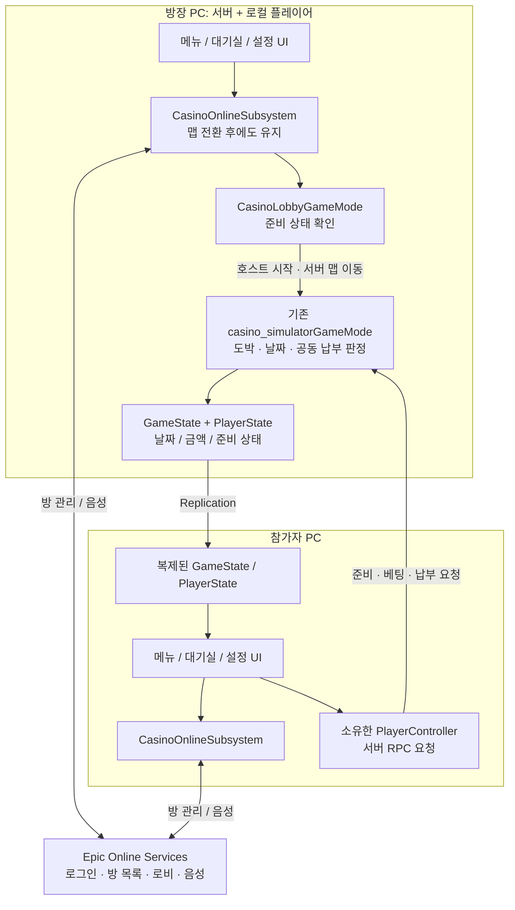
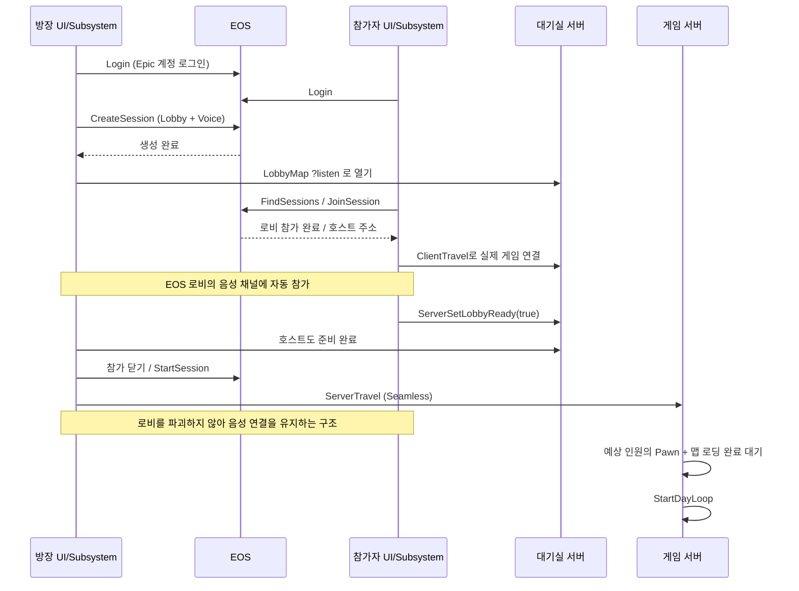

# Casino 인터넷 멀티·보이스 구조와 BP 연결

이 문서는 UE 5.7 프로젝트에 추가한 실제 C++ 코드 기준이다.
코드/플러그인 빌드는 확인했지만 EOS 계정 로그인, 서로 다른 PC 연결, 실제 마이크 송수신은 아직 검증하지 않았다.
Epic 개발자 포털 등록값과 메뉴/대기실 UI·맵 설정이 있어야 인터넷 테스트가 가능하다.

## 1. 서버는 어디에 있나?

리슨 서버에서는 **방장 컴퓨터가 서버이면서 플레이어**다.
팀원의 컴퓨터는 서버에 행동을 요청하고 서버가 확정한 결과를 받는다.
EOS가 카지노 게임 계산까지 실행해주는 것은 아니다.



준비 요청은 대기실 서버에서, 게임 요청은 게임 맵 서버에서 처리된다.
호스트를 다른 사람으로 넘기는 기능은 없다. 호스트가 나가면 방이 종료된다.

## 2. 각 래스의 책클임

| 클래스 | 존재 위치 / 수명 | 책임 |
|---|---|---|
| UCasinoOnlineSubsystem | 각 PC의 GameInstance, 맵 전환 유지 | 로그인, 방 생성/검색/참가/퇴장, 보이스 설정 |
| ACasinoLobbyGameMode | 대기실 서버에만 존재 | 준비 상태 검사, 방 시작 중 참가 차단 |
| Acasino_simulatorGameMode | 게임 맵 서버에만 존재 | 기존 AI/체포/보석금, 날짜/납부/결과 |
| Acasino_simulatorPlayerController | 서버의 각 플레이어 + 본인 클라이언트 | 본인 준비/납부 요청 RPC |
| Acasino_simulatorPlayerState | 서버와 모든 클라이언트 | 준비 여부 bLobbyReady 복제 |
| ACasinoLoopGameState | 서버와 모든 클라이언트 | 날짜/목표/공동 납부액/게임 결과 복제 |
| UCasinoOnlineSettings | 프로젝트 설정 | 메뉴/대기실/게임 맵, 방 인원, BuildId |
| UCasinoVoicePreferences | 각 PC 로컬 설정 파일 | 마이크 음소거, PTT 방식, 듣기 볼륨, 입력 장치 |

GameMode는 클라이언트에서 Get Game Mode로 얻을 수 없다.
표시용 데이터는 GameState/PlayerState, 온라인 메뉴 호출은 GameInstanceSubsystem을 사용한다.
Subsystem의 State는 해당 PC의 온라인 작업 상태이고, GameState의 Phase는 서버가 복제한 하루 진행 상태다.

## 3. 방에서 게임까지



호스트 버튼은 StartHostedGame을 호출한다. 서버 RPC로 다른 사람에게 시작 권한을 넘기지 않는다.
방장의 로컬 Subsystem이 자신이 방 소유자인지 확인한 뒤 대기실 서버 준비 상태를 검사한다.
게임 시작 후 중도 참가/재접속은 지원하지 않는다. 로딩이 90초 내 끝나지 않으면 GameOver 상태가 된다.
단순히 세션 참가가 성공했다고 실제 맵 연결까지 성공한 것은 아니다. 네트워크/맵 이동 오류도 OnError로 받는다.

## 4. 핵심 코드 읽는 법

### 로그인

```cpp
Identity->Login(0, FOnlineAccountCredentials(TEXT("accountportal"), TEXT(""), TEXT("")));
```

현재 PC의 첫 번째 로컬 플레이어가 Epic 계정 로그인 창을 이용한다.
이 함수는 결과가 즉시 나오지 않는다. LoginComplete가 호출될 때 Ready 또는 Offline으로 바뀐다.
화면 버튼은 State가 작업 중이면 비활성화하고, OnError의 Message를 표시한다.

### 방 + 음성 로비 생성

```cpp
Settings.bIsLANMatch = false;
Settings.bUseLobbiesIfAvailable = true;
Settings.bUseLobbiesVoiceChatIfAvailable = true;
Sessions->CreateSession(0, NAME_GameSession, Settings);
```

EOS OSS가 로비와 연결된 음성 채널의 참가/퇴장을 관리한다.
별도의 음성용 Login/JoinChannel을 중복 호출하지 않는다.
이 설정만으로 포털 설정이나 클라이언트 정책이 자동 생성되지는 않는다.

### 참가

```cpp
Sessions->GetResolvedConnectString(NAME_GameSession, Address);
PC->ClientTravel(Address, TRAVEL_Absolute);
```

방 목록 데이터에 들어 있는 호스트 연결 정보를 EOS 네트워크 주소로 해석한 뒤 접속한다.
IP 주소를 직접 하드코딩하지 않는다.

### 서버에서 준비 여부 변경

```cpp
void Acasino_simulatorPlayerController::ServerSetLobbyReady_Implementation(bool bReady)
{
    // 현재 월드가 대기실인지, 방이 아직 시작 전인지 검사한 뒤
    // 이 컨트롤러 본인의 PlayerState만 변경한다.
    // 실제 구현은 casino_simulatorPlayerController.cpp 참고.
}
```

본인 컨트롤러의 서버 RPC이므로 UI에 다른 플레이어 객체를 인자로 넘길 필요가 없다.
서버가 바꾼 bLobbyReady는 Replicated 프로퍼티라 다른 사람의 화면에도 전달된다.

### 보이스 설정

```cpp
Voice->SetAudioInputDeviceMuted(Pref->bMicrophoneMuted);
Voice->SetAudioOutputVolume(Pref->OutputVolume);
// PTT 키를 누르고 있고 음소거가 아닐 때만 송신
Voice->TransmitToAllChannels();
// 키를 놓으면 송신 중지
Voice->TransmitToNoChannels();
```

볼륨은 듣는 사람의 로컬 설정이다. 다른 사람의 마이크나 컴퓨터 볼륨을 원격 변경하는 기능이 아니다.
기본은 PTT. 키 바인딩은 BP/Enhanced Input에서 연결한다.
Alt-Tab과 맵 로딩 시 PTT 누름 상태를 초기화한다.

## 5. Epic 개발자 포털에서 해야 할 일

1. Epic Developer Portal에서 조직/제품을 준비한다.
2. 같은 제품의 Product ID, Sandbox ID, Deployment ID를 확인한다.
3. 클라이언트를 만들고 게임 클라이언트용 정책을 연결한다.
4. 로그인/Connect, 로비, P2P 연결, 음성에 필요한 권한을 공식 포털 문서에 맞춰 허용한다.
5. accountportal 로그인을 위한 Epic Account Services 애플리케이션과 클라이언트 연결을 설정한다.
6. 개발 중 제한된 배포라면 팀원의 테스트 계정을 조직/테스트 접근 권한에 등록한다.
7. UE Project Settings > Plugins > Online Subsystem EOS에서 Artifacts 항목을 추가한다.
8. Artifact Name을 정하고 Default Artifact Name에도 같은 값을 넣는다.
9. Client ID / Client Secret / Product ID / Sandbox ID / Deployment ID를 입력한다.
10. Client Encryption Key 등 필요한 항목을 공식 EOS 설정 문서에 따라 채운다.

자격 증명을 이 문서나 공개 채팅에 붙이지 않는다. 런타임 클라이언트용 정책을 사용한다.
현재 소스에는 가짜 ID/Secret을 넣지 않았다. 따라서 지금 실행하면 artifact 설정이 없다는 로그가 나오는 것이 예상된다.
EOS 설정 뒤 에디터를 재시작한다. 이미 실패한 OSS 초기화는 UI 로그인 버튼만으로 재설정되지 않을 수 있다.

공식 문서:
- https://dev.epicgames.com/documentation/en-us/unreal-engine/online-subsystem-eos-plugin-in-unreal-engine?application_version=5.7
- https://dev.epicgames.com/documentation/en-us/unreal-engine/voice-chat-with-epic-online-services

## 6. 맵과 에디터 설정

세 맵과 위젯 에셋은 이번 코드 작업에서 생성하지 않았다. 아래 이름은 만들 때 사용할 예시다.

1. 메뉴 맵: L_MainMenu. 빈 맵 + 메뉴 카메라 + 메뉴 UI.
2. 대기실 맵: L_Lobby. 참가자 목록/준비/시작/음성 설정 UI.
3. 게임 맵: 기존 카지노 맵. 기존 BP_FirstPersonGameMode 유지.
4. Project Settings > Game > Casino Online에서 Menu Map / Lobby Map / Game Map에 실제 맵을 지정.
5. Project Settings > Maps & Modes > Game Default Map을 메뉴 맵으로 지정.
6. Packaging > List of maps to include에 위 세 맵을 추가해 패키징 누락을 방지.
7. 게임 맵의 Game State Class가 CasinoLoopGameState인지 확인.
8. 게임 맵에는 CasinoPaymentSpawn 태그의 중앙 위치를 인원수만큼 배치.
9. 기존 BP GameMode의 BeginPlay를 오버라이드했다면 Call to Parent BeginPlay를 유지.

로비 호스트 생성 시 C++에서 `?game=/Script/casino_simulator.CasinoLobbyGameMode`를 지정하므로
로비 맵은 날짜 루프 대신 로비 GameMode로 열린다. 게임 맵은 기존 게임모드를 사용한다.
로비는 기존 BP_FirstPersonPlayerController와 기존 PlayerState를 사용하고 Pawn은 SpectatorPawn이다.
로비의 캐릭터 전시/카메라/화면 디자인은 별도 BP 작업이다.
기존 컨트롤러 BP가 BeginPlay에서 HUD를 무조건 만든다면 메뉴/로비에서 게임 HUD를 숨기는 분기를 추가한다.

현재 DefaultEngine.ini는 EOS를 기본 서비스/P2P NetDriver로 설정했다.
EOS 구성 전의 일반 PIE 멀티 동작은 이전 IP NetDriver 테스트와 같다고 가정하지 않는다.
실제 검증은 별도 프로세스/패키징된 실행 파일 두 개와 서로 다른 Epic 계정으로 한다.

## 7. 메뉴 BP 연결

각 위젯에서 Get Game Instance Subsystem을 검색하고 클래스 CasinoOnlineSubsystem을 선택한다.
위젯 변수 OnlineRef에 보관한다. 별도 Create Object/Create Widget으로 Subsystem을 만들지 않는다.

| 버튼/표시 | 연결 |
|---|---|
| 로그인 | OnlineRef > Login |
| 방 만들기 | OnlineRef > Create Room(RoomName) |
| 새로고침 | OnlineRef > Find Rooms |
| 방 목록 | OnChanged 이후 Rooms 배열 순회 |
| 목록 행 참가 | 행의 SearchIndex를 Join Room에 전달 |
| 실패 메시지 | OnError(Operation, Message) 바인딩 |
| 로딩 표시 | State가 LoggingIn/Creating/Searching/Joining/Starting/Leaving인지 검사 |

Rooms 배열의 화면상 순번 대신 **각 행의 SearchIndex**를 전달한다.
새 검색마다 기존 목록 위젯을 지우고 다시 만든다.
검색 중/참가 중 버튼 중복 입력은 막는다.
위젯이 닫힐 때 본인이 바인딩한 델리게이트만 해제한다. 다른 UI의 이벤트를 Unbind All로 지우지 않는다.

## 8. 대기실 BP 연결

- 참가자 목록: Get Game State > Player Array.
- 각 PlayerState를 casino_simulatorPlayerState로 Cast.
- 이름: Get Player Name, 준비 표시: bLobbyReady.
- 목록/준비 표시는 0.2~0.5초 타이머로 갱신해도 된다. 이벤트 방식은 별도 연결 가능.
- 내 준비 버튼: Get Owning Player > Cast casino_simulatorPlayerController > Server Set Lobby Ready.
- 호스트 시작 버튼: OnlineRef > Is Room Host가 true일 때만 표시, 클릭은 Start Hosted Game.
- 시작 전 **호스트 자신도 준비**해야 한다.
- 나가기: OnlineRef > Leave Room.
- 보이스는 Is Voice Connected를 따로 표시한다. 방 참가 성공과 음성 연결 성공은 서로 다른 상태다.

## 9. 대기실/게임 공통 음성 설정 BP

| UI | 함수 |
|---|---|
| 마이크 음소거 체크 | Set Microphone Muted |
| PTT / 항상 켜기 | Set Push To Talk Enabled |
| 듣기 볼륨 슬라이더 0~1 | Set Voice Output Volume |
| 마이크 장치 목록 | Get Voice Input Devices → 항목 Id로 Set Voice Input Device |
| 플레이어 음소거 | Get Voice Id For Player(PlayerState) → Set Voice Player Muted |
| 말하는 사람 아이콘 | Is Voice Player Talking(VoicePlayerId) |

Enhanced Input의 IA_PushToTalk를 만들고 원하는 키(예: V)를 연결한다.
Started → Set Push To Talk Held(true).
Completed와 Canceled → Set Push To Talk Held(false).
UI Only 입력 모드에서는 일반 게임 입력이 차단되므로 대기실 입력 모드도 설계해야 한다.
Game and UI를 사용하거나 위젯 키 이벤트에서 같은 함수를 호출한다.
UI 포커스를 잃거나 대기실 위젯을 닫을 때도 Held(false)를 호출한다.
설정 화면은 Getter로 현재 값을 읽는다. 위젯별로 별도의 음소거 변수를 만들지 않는다.
개인 음소거는 방을 떠날 때 초기화되며 마이크/PTT/볼륨/장치 설정은 로컬 파일에 저장된다.
마이크 녹음 테스트/키 리바인딩 UI 자체는 이번에 만들지 않았다.

## 10. 게임 맵과 하루 루프 연결

온라인 시작은 `CasinoOnlineMatch=1`, `ExpectedPlayers=N` 옵션을 넘긴다.
게임 GameMode는 0.5초 간격으로 N명의 Pawn/맵 로딩을 기다린 뒤 StartDayLoop를 한 번 호출한다.
온라인에서는 bAutoStartDayLoop 대신 이 경로가 우선한다.
싱글 테스트에서는 기존 bAutoStartDayLoop 또는 수동 StartDayLoop를 계속 사용할 수 있다.
중앙 태그가 없다면 StartDayLoop는 로그를 남기고 시작을 거절한다.

남아 있는 기존 BP 연결:
- ForceEndCasinoGamesForDay: 각 도박의 예약 정산 취소/패배 종료/좌석 해제.
- OnPrepareDailyPayment: 카지노 UI 닫기.
- OnPrepareCasinoDay: 납부 UI 닫기.
- 신규 베팅 서버 승인 조건: CanPlayCasino.
- GameState Phase에 따라 날짜/납부/성공/실패/클리어 UI 표시.
- 결과 화면의 메인 메뉴 버튼은 OpenLevel만 호출하지 말고 LeaveRoom을 호출해 EOS 방도 정리.

온라인 코드 추가만으로 이 BP 작업들이 자동 완료되지는 않는다.

## 11. 검증 순서

1. 빌드 성공 확인, EOS artifact 설정 후 에디터 재시작.
2. 두 계정으로 독립 실행. 메뉴에서 각각 Login → Ready 확인.
3. A가 방 생성, B가 검색/참가. 서버 PlayerArray에 두 사람 표시.
4. 대기실에서 A/B 음성 연결 표시 확인. PTT/음소거/볼륨 테스트.
5. B만 준비하면 시작 거절, 모두 준비하고 A가 시작하면 함께 게임 맵 이동.
6. 모든 로딩 완료 뒤 하루 타이머 시작 확인.
7. 맵 이동 후 음성 유지, 키를 놓은 상태에서는 PTT 송신이 꺼져 있는지 확인.
8. B 퇴장 후 방 검색 재시도. A가 퇴장하면 B가 오류/방 종료를 받고 메뉴로 돌아오는지 확인.
9. 로그인 취소, 꽉 찬 방, 호스트 종료, 네트워크 끊김, 잘못된 맵 설정 테스트.
10. 서로 다른 집/네트워크에서 같은 절차 반복.

이번 작업의 실행 확인: Editor Development 빌드 성공. Entry 맵 명령줄 실행 및 정상 종료 확인.
현재 artifact 미설정으로 EOS 초기화 실패 로그가 발생하며 실접속/보이스는 미검증.
기존 FItemData::UniqueID 기본값 미초기화 로그도 발견했지만 온라인 작업과 무관해 수정하지 않았다.
