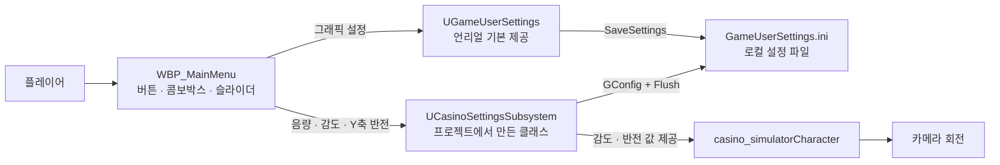
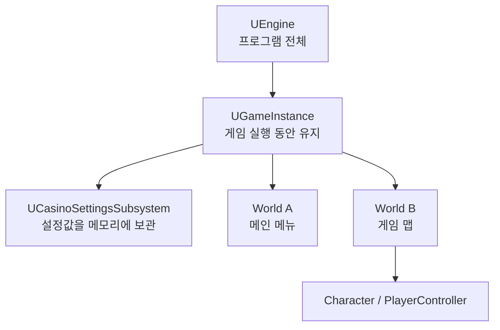
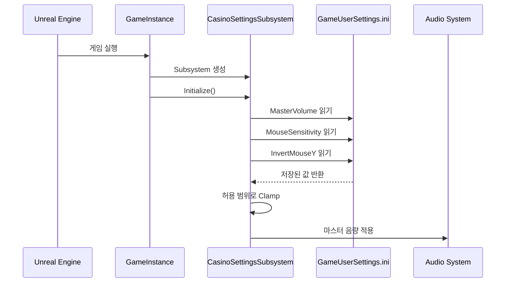
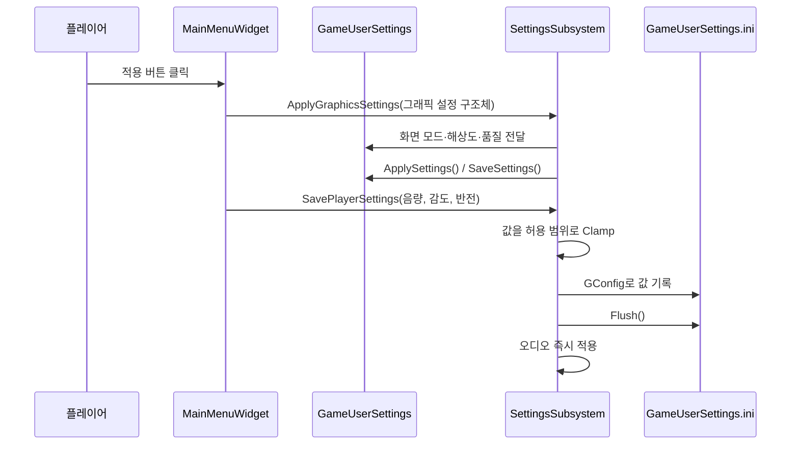
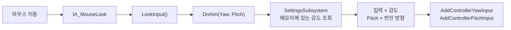
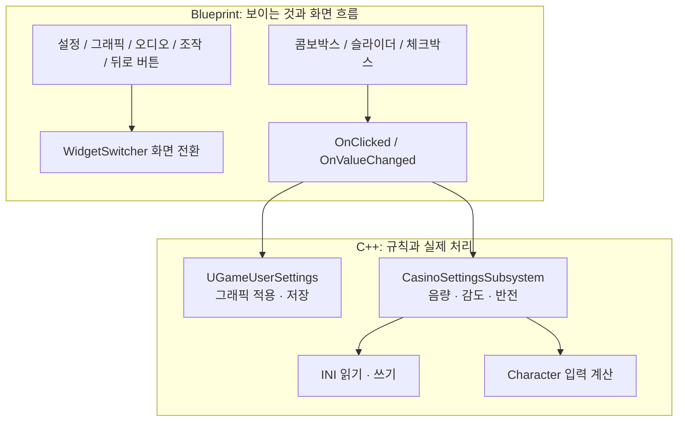

# Casino 설정 시스템 가이드

이 문서는 현재 프로젝트에 구현된 C++ 설정 시스템을 기준으로 작성한 학습용 문서다.
설정을 어디서 만들고, 언제 불러오며, UI와 플레이어 입력에서 어떻게 사용하는지 설명한다.

> 범위: 그래픽, 오디오, 마우스 감도, Y축 반전, C++과 BP 위젯의 연결

## 1. 한눈에 보는 전체 구조



| 구성 요소 | 담당 역할 | 수명 / 저장 위치 |
|---|---|---|
| `WBP_MainMenu` | 화면 표시, 버튼과 슬라이더 입력 | 위젯이 열려 있는 동안 |
| `UCasinoMainMenuWidget` | `WBP_MainMenu`가 상속하는 비어 있는 C++ 기반 클래스 | 위젯이 열려 있는 동안 |
| `UCasinoSettingsSubsystem` | 그래픽 적용 API와 마스터 음량, 감도, Y축 반전 관리 | `GameInstance`와 같은 수명 |
| `UGameUserSettings` | 해상도, 화면 모드, 품질, VSync, 프레임 제한 | 언리얼이 관리 |
| `GameUserSettings.ini` | 게임을 껐다 켜도 로컬 설정 유지 | 사용자 PC의 디스크 |
| `casino_simulatorCharacter` | 저장된 감도를 실제 시점 회전에 사용 | 현재 플레이어 캐릭터의 수명 |

## 2. 왜 `GameInstanceSubsystem`인가?

`UGameInstanceSubsystem`은 언리얼이 제공하는 **기능의 틀**이다.
음량이나 감도 기능이 원래 들어 있는 클래스가 아니라, 우리가 오래 유지할 시스템을 넣을 자리다.



게임이 시작되면 대략 다음 순서로 생성된다.

```text
프로그램 시작
→ GameInstance 생성
→ GameInstanceSubsystem 생성
→ UCasinoSettingsSubsystem::Initialize() 호출
→ World 생성
→ GameMode / PlayerController / Character 생성
```

따라서 플레이어가 만들어지기 전에 로컬 설정을 읽어둘 수 있다.
맵을 바꾸며 기존 `World`가 사라져도 같은 `GameInstance`를 사용하는 동안 Subsystem은 유지된다.

## 3. 설정 종류별 담당자

### 그래픽 설정

그래픽 설정은 언리얼 기본 클래스인 `UGameUserSettings`가 담당한다.

| 설정 | 값을 읽는 함수 | 값을 바꾸는 함수 |
|---|---|---|
| 화면 모드 | `GetFullscreenMode()` | `SetFullscreenMode()` |
| 해상도 | `GetScreenResolution()` | `SetScreenResolution()` |
| 전체 그래픽 품질 | `GetOverallScalabilityLevel()` | `SetOverallScalabilityLevel()` |
| 수직 동기화 | `IsVSyncEnabled()` | `SetVSyncEnabled()` |
| 프레임 제한 | `GetFrameRateLimit()` | `SetFrameRateLimit()` |

설정 관리 객체는 다음처럼 가져온다.

```cpp
UGameUserSettings* GameSettings =
    GEngine ? GEngine->GetGameUserSettings() : nullptr;
```

사용자가 고른 값을 넣은 뒤 두 단계로 마무리한다.

```cpp
GameSettings->ApplySettings(false); // 현재 게임에 적용
GameSettings->SaveSettings();       // 다음 실행을 위해 파일에 저장
```

### 플레이어 설정

현재 프로젝트에서는 다음 값을 `UCasinoSettingsSubsystem`이 담당한다.

| 변수 | 기본값 | 허용 범위 | 의미 |
|---|---:|---:|---|
| `MasterVolume` | `1.0` | `0.0 ~ 1.0` | 게임 전체 음량 배율 |
| `MouseSensitivity` | `1.0` | `0.1 ~ 2.0` | 시점 회전 입력 배율 |
| `bInvertMouseY` | `false` | 참 / 거짓 | 세로 마우스 입력 방향 반전 |

이 값들은 `UGameUserSettings`의 기본 기능이 아니므로 프로젝트에서 직접 추가한 것이다.

## 4. 게임 시작 시 불러오는 과정

Subsystem이 만들어지면 `Initialize()`가 자동 호출된다.

```cpp
void UCasinoSettingsSubsystem::Initialize(
    FSubsystemCollectionBase& Collection)
{
    Super::Initialize(Collection);
    LoadPlayerSettings();
    ApplyAudioSettings();
}
```



`LoadPlayerSettings()`는 `GConfig`를 이용한다.

```cpp
GConfig->GetFloat(
    TEXT("Casino.PlayerSettings"),
    TEXT("MouseSensitivity"),
    MouseSensitivity,
    GGameUserSettingsIni);
```

각 인자의 뜻은 다음과 같다.

| 인자 | 의미 |
|---|---|
| `Casino.PlayerSettings` | INI 안의 섹션 이름 |
| `MouseSensitivity` | 읽을 항목의 이름 |
| `MouseSensitivity` 변수 | 읽은 값을 넣을 C++ 변수 |
| `GGameUserSettingsIni` | 사용할 실제 INI 파일 |

## 5. INI 파일

`INI`는 **Initialization file**에서 나온 이름이다.
이 프로젝트의 에디터 실행 설정은 일반적으로 다음 경로에 만들어진다.

```text
Saved/Config/WindowsEditor/GameUserSettings.ini
```

현재 사용자 정의 설정은 다음 형태로 저장된다.

```ini
[Casino.PlayerSettings]
MasterVolume=1.0
MouseSensitivity=1.0
InvertMouseY=False
```

`[Casino.PlayerSettings]`는 언리얼 기본 섹션이 아니다.
프로젝트에서 `GConfig`로 읽고 쓰기 위해 직접 정한 이름이다.

INI는 모든 게임 데이터를 저장하는 파일이 아니다.

| 데이터 | 알맞은 저장 방식 |
|---|---|
| 해상도, 그래픽 품질 | 로컬 INI |
| 로컬 음량, 감도, Y축 반전 | 현재 구현에서는 로컬 INI |
| 싱글플레이 진행도와 인벤토리 | `USaveGame` 기반 `.sav` |
| 현재 실행 중인 Actor 포인터 | 저장하지 않고 필요할 때 다시 찾기 |

## 6. 사용자가 적용 버튼을 누를 때

BP 위젯의 적용 버튼이 `UCasinoSettingsSubsystem`에 그래픽 설정과 플레이어 설정을 전달한다.



`SavePlayerSettings()`에서 `Clamp`를 사용하는 이유는 잘못된 값이 들어와도 안전한 범위로 제한하기 위해서다.

```cpp
MasterVolume = FMath::Clamp(InMasterVolume, 0.0f, 1.0f);
MouseSensitivity = FMath::Clamp(InMouseSensitivity, 0.1f, 2.0f);
```

`GConfig->Flush()`는 메모리에서 변경한 설정을 실제 INI 파일에 기록한다.

## 7. 마우스 감도가 실제로 사용되는 과정

입력 설정값을 매 프레임 INI에서 읽는 것은 아니다.
게임 시작 시 INI를 한 번 읽어 Subsystem의 메모리에 보관하고, 입력 처리에서는 그 값을 가져온다.



핵심 계산은 다음과 같다.

```cpp
AddControllerYawInput(Yaw * Sensitivity);
AddControllerPitchInput(Pitch * Sensitivity * PitchDirection);
```

Y축 반전 여부에 따라 `PitchDirection`은 달라진다.

```cpp
PitchDirection = Settings->IsMouseYInverted() ? -1.0f : 1.0f;
```

### 현재 구현의 주의점

`LookAction`과 `MouseLookAction`이 모두 같은 `LookInput()`과 `DoAim()`을 사용한다.
따라서 현재는 마우스용 감도가 게임패드 시점 입력에도 함께 곱해질 수 있다.
나중에는 마우스와 게임패드 감도를 분리하는 편이 좋다.

## 8. 오디오 적용

현재 마스터 음량은 다음 함수로 애플리케이션 전체에 적용한다.

```cpp
FApp::SetVolumeMultiplier(MasterVolume);
```

현재 구현은 단일 마스터 음량만 제공한다.
음악, 효과음, 음성, UI 소리를 각각 조절하려면 이후 `SoundClass`와 `SoundMix`를 이용해 분리할 수 있다.

```text
Master
├─ Music
├─ SFX
├─ Voice
└─ UI
```

## 9. C++ 위젯과 BP 위젯의 현재 연결

`WBP_MainMenu`는 `UCasinoMainMenuWidget`을 부모 클래스로 사용하지만, 부모 클래스는 이제 UI를 만들거나 버튼을 자동으로 찾지 않는다.

```cpp
UCLASS()
class CASINO_SIMULATOR_API UCasinoMainMenuWidget : public UUserWidget
{
    GENERATED_BODY()
};
```

따라서 현재 역할은 다음처럼 분리되어 있다.

| 위치 | 역할 |
|---|---|
| `WBP_MainMenu` | 위젯 배치, `WidgetSwitcher`, 버튼 이벤트, 현재 값 표시 |
| `UCasinoMainMenuWidget` | BP가 상속할 C++ 타입 제공 |
| `UCasinoSettingsSubsystem` | BP가 호출할 설정 조회·적용·초기화 함수 제공 |

C++은 더 이상 `WidgetTree->FindWidget()`이나 `AddDynamic()`으로 BP 위젯을 조작하지 않는다.

## 10. `Transient`의 의미

리팩터링 전 동적 UI 코드에는 다음과 같은 포인터가 있었다.

```cpp
UPROPERTY(Transient)
TObjectPtr<USlider> SensitivitySlider;
```

`Transient`는 이 변수를 에셋이나 저장 파일에 직렬화하지 말라는 뜻이다.
위젯 포인터는 실행 중에만 유효하므로 저장할 필요가 없다.

```text
위젯 생성
→ C++ 포인터가 실제 슬라이더를 가리킴
→ 위젯 제거
→ 해당 연결도 사라짐
→ 다음 생성 때 다시 연결
```

`UPROPERTY`는 언리얼의 객체 추적과 가비지 컬렉션에 참여하게 하고,
`Transient`는 그중에서도 디스크에 저장하지 않을 실행 중 참조라는 뜻이다.

## 11. BP에서 Subsystem 가져오기

BP에서는 다음 순서로 설정 시스템을 가져올 수 있다.

```text
Get Game Instance
→ Get Subsystem (CasinoSettingsSubsystem)
→ 원하는 설정 함수 호출
```

현재 다음 함수들이 BP에 공개되어 있다.

| BP 함수 | 용도 |
|---|---|
| `GetGraphicsSettings()` | 현재 그래픽 설정 구조체 읽기 |
| `ApplyGraphicsSettings()` | 그래픽 설정 검증·적용·저장 |
| `ResetGraphicsSettings()` | 그래픽 기본값 적용 |
| `GetPlayerSettings()` | 음량·감도·반전 구조체 읽기 |
| `GetMasterVolume()` | 현재 마스터 음량 읽기 |
| `GetMouseSensitivity()` | 현재 감도 읽기 |
| `IsMouseYInverted()` | Y축 반전 여부 읽기 |
| `SavePlayerSettings()` | 음량·감도·반전 검증·적용·저장 |
| `ResetPlayerSettings()` | 플레이어 설정 기본값 적용 |

### BP 연결 순서

`WBP_MainMenu`의 `Event Construct`에서 현재 설정을 UI에 채운다.

```text
Event Construct
→ Get Game Instance Subsystem (CasinoSettingsSubsystem)
→ Promote to Variable: SettingsSubsystem
→ Get Graphics Settings
→ Break CasinoGraphicsSettings
→ 각 콤보박스·체크박스에 현재 값 표시
→ Get Player Settings
→ Break CasinoPlayerSettings
→ 음량·감도 슬라이더와 Y축 반전 체크박스에 현재 값 표시
```

적용 버튼에서는 UI의 현재 값을 구조체와 함수 인자로 전달한다.

```text
ApplyButton.OnClicked
→ Make CasinoGraphicsSettings
   - Window Mode
   - Resolution
   - Quality Level
   - Frame Rate Limit
   - VSync Enabled
→ SettingsSubsystem.Apply Graphics Settings
→ SettingsSubsystem.Save Player Settings
   - Master Volume
   - Mouse Sensitivity
   - Invert Mouse Y
```

기본값 버튼은 두 초기화 함수를 호출한 뒤 `Get` 함수들로 UI 표시값을 다시 채운다.

```text
DefaultsButton.OnClicked
→ Reset Graphics Settings
→ Reset Player Settings
→ 현재 설정을 UI에 다시 표시
```

카테고리 버튼과 뒤로 가기는 설정 저장 함수와 연결하지 않고 BP의 `WidgetSwitcher`와 패널 표시 상태만 바꾼다.

## 12. 리팩터링된 구조

현재는 **화면 구성과 이벤트는 BP**, **실제 설정 로직은 C++**로 역할을 나눴다.



### BP가 맡을 일

- 설정 화면의 모양과 배치
- 그래픽, 오디오, 조작 카테고리 전환
- 뒤로 가기 동작
- 버튼과 슬라이더 이벤트
- 현재 값을 화면에 표시

### C++가 맡을 일

- 설정값의 유효 범위 검사
- 그래픽 설정 적용과 저장
- 음량, 감도, 반전 값 관리
- INI 읽기와 쓰기
- 실제 캐릭터 입력에 감도 적용

## 13. 전체 흐름 요약

```text
[게임 시작]
GameInstance
→ CasinoSettingsSubsystem 생성
→ INI에서 플레이어 설정 읽기
→ 메모리에 보관
→ 음량 적용

[설정 화면 열기]
BP 위젯
→ UGameUserSettings에서 그래픽 값 읽기
→ CasinoSettingsSubsystem에서 플레이어 값 읽기
→ 콤보박스와 슬라이더에 표시

[적용 버튼]
BP 위젯
→ 그래픽: UGameUserSettings에 전달
→ 음량·감도·반전: CasinoSettingsSubsystem에 전달
→ 현재 게임에 적용
→ GameUserSettings.ini에 저장

[마우스 이동]
IA_MouseLook
→ LookInput
→ DoAim
→ Subsystem 메모리에서 감도와 반전 조회
→ 입력값 계산
→ 카메라 회전
```

## 14. 관련 코드 위치

| 파일 | 내용 |
|---|---|
| `Source/casino_simulator/UI/CasinoSettingsSubsystem.h` | BP용 설정 구조체와 설정 API 선언 |
| `Source/casino_simulator/UI/CasinoSettingsSubsystem.cpp` | 그래픽 적용, INI 로드·저장, 오디오 적용 |
| `Source/casino_simulator/UI/CasinoMainMenuWidget.h` | BP가 상속하는 얇은 위젯 기반 클래스 |
| `Source/casino_simulator/UI/CasinoMainMenuWidget.cpp` | 위젯 기반 클래스 구현 파일 |
| `Source/casino_simulator/casino_simulatorCharacter.cpp` | 감도와 Y축 반전을 시점 입력에 사용 |
| `Saved/Config/WindowsEditor/GameUserSettings.ini` | 에디터에서 사용하는 로컬 설정값 |

---

핵심은 다음 한 문장으로 정리할 수 있다.

> UI는 값을 선택하고, C++ 설정 시스템은 그 값을 검증·적용·저장하며, 게임 코드는 저장된 값을 필요한 순간에 사용한다.
